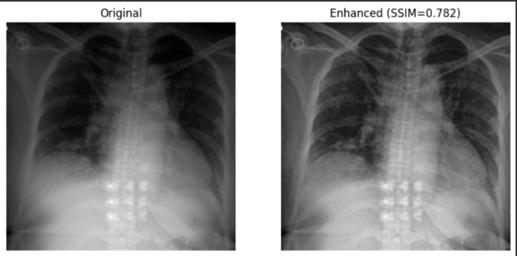
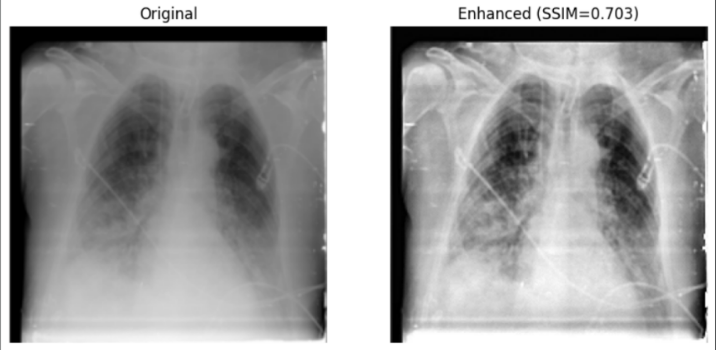
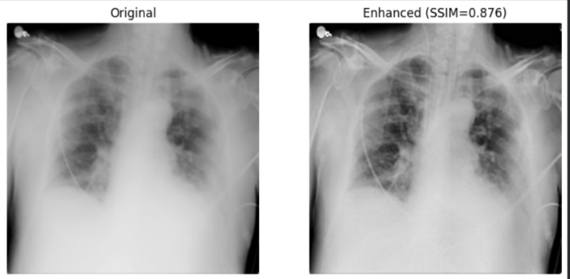
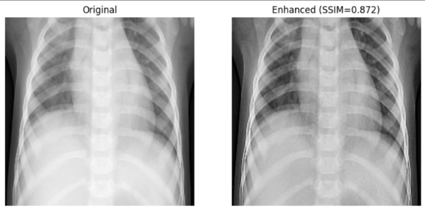
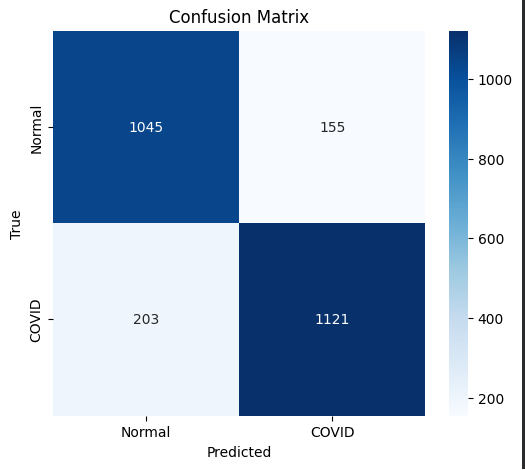

# Preparing High-Quality X-ray Images for AI-based Diagnostic System

**Course:** Research Methods and Tools (SE-2307)
**Team:** Saulet Kabdrakhmanov, Galymzhan Aliakbar, Aruzhan Atelova, Bekzhan Nurallin.

## 📌 Project Overview
This repository documents the entire research process for improving chest X-ray image quality to enhance AI diagnostic performance. We investigate how preprocessing techniques (CLAHE, Gaussian Blur, Normalization) affect image consistency and clarity.

## 🎯 Research Aim
To improve the quality and consistency of chest X-ray images used in AI-based diagnostic systems through the evaluation of preprocessing techniques and the development of a standardized image preparation pipeline.

## ✒️ Project Schedule

| Week | Research Phase | Objectives / Tasks | Deadline |
| :--- | :--- | :--- | :--- |
| **Week 1-2** | **Data Review and Preparation** | • Define research questions • Collect all required chest X-ray datasets • Check image quality and identify noise, artefacts, and incorrect labels • Create a catalog separating “clean” and “noisy” images | **End of Week 2** |
| **Week 3-4** | **Interview, Data Cleaning & Enhancement, Writing Introduction** | • Conduct interviews with specialists or lecturers (ML/CV) • Apply preprocessing and enhancement techniques (e.g., noise reduction, contrast adjustment) • Remove low-quality or duplicate images • Develop a script for automated data cleaning • Read and analyze relevant extra articles • Equally separate tasks among the team • Discuss tasks with the team to find common solutions | **End of Week 4** |
| **Week 5-6** | **Model Testing with Improved Dataset** | • Train a baseline model using the improved dataset • Compare model accuracy with results from the original dataset • Analyze how data quality affects model performance | **End of Week 6** |
| **Week 7-8** | **Evaluation and Validation & Writing Methodology** | • Evaluate model performance using metrics • Visualize results with graphs and confusion matrices • Summarize findings and performance improvements • Read and analyze relevant extra articles • Equally separate tasks among the team • Discuss tasks with the team to find common solutions | **End of Week 8** |
| **Week 9-10** | **Reporting and Final Review & Create Final Paper** | • Write the final report (results, conclusions, limitations) • Review and format the document according to submission guidelines • Prepare the presentation or defense of the project | **End of Week 10** |

## 📂 Repository Structure
* `docs/`: Contains all research reports, methodology chapters, and drafts.
* `instruments/`: Interview scripts, survey forms, and data collection tools.
* `notebooks/`: Python code (Jupyter/Colab) for the preprocessing pipeline.
* `process/`: Project grahps and feedback logs.
* `image/`: Sample images.
* `model`: Containts trained models(effientNetB0, mobileNetV2) that we are used.

## 🛠 Methodology & Tools
We utilize a Python-based pipeline involving:
1. **Resizing** (224x224)
2. **Grayscale Conversion**
3. **Noise Reduction** (Bilateral Filter)
4. **Contrast Enhancement** (CLAHE)
5. **Quality Verification** (SSIM, Brightness Mean)

**Libraries:** OpenCV, NumPy, Matplotlib, scikit-image.

## 🚀 How to Reproduce
1. Download mannually notebook.
2. Open `notebooks/xray.ipynb`. You might though Google Colab.
3. Download datasets ([LINK TAP TAP](https://www.kaggle.com/datasets/tawsifurrahman/covid19-radiography-database?)), upload to your google disk and upload to your RAM memory(google colab) update the path in the notebook.
4. Run all cells to see the transformation from Raw to Enhanced images.
5. Not working? Write me 😎

## 📊 Key Results
Preliminary results show an improvement in visual clarity for lung structures.
* **Average SSIM:** ~0.87 (indicating structural integrity is preserved)
* **Brightness:** Normalized to range [100-160]

## 🖼️ Example of pictures of our pipline

## 🖌️ Graphs (example of mobileNETV2) 

<h3>*you can also check other pictures!*</h3>

---
*This project is part of the academic curriculum at Astana IT University.*
